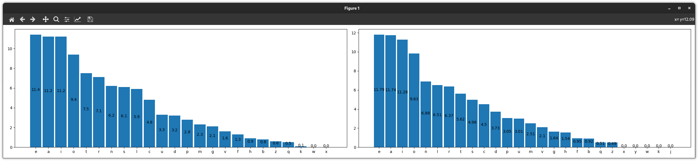
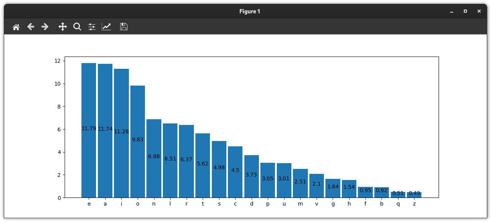

# LCryp

A simple tool to analyze frequencies in a ciphered text and display graphs of them.
The tool has frequencies data just for italian.

Screenshots:
`python3 main.py -i text.txt`

`python3 main.py`

